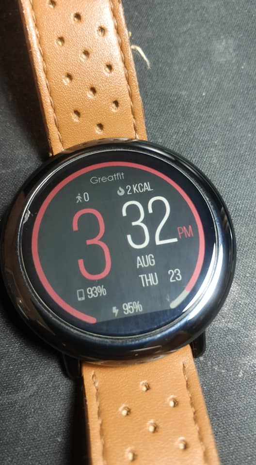
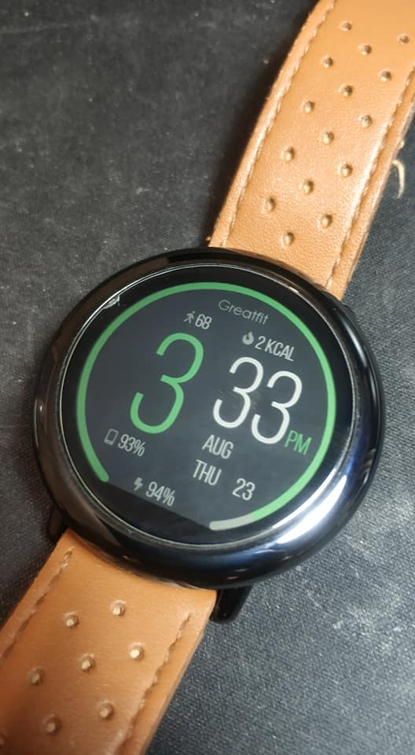
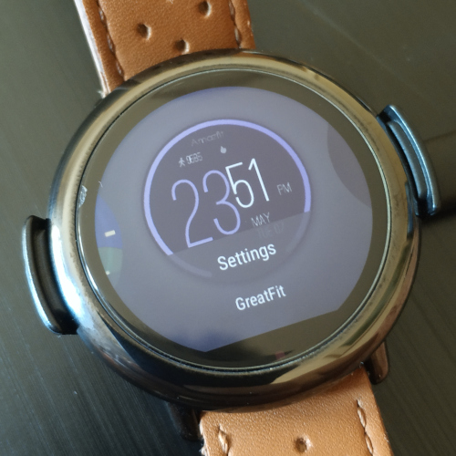
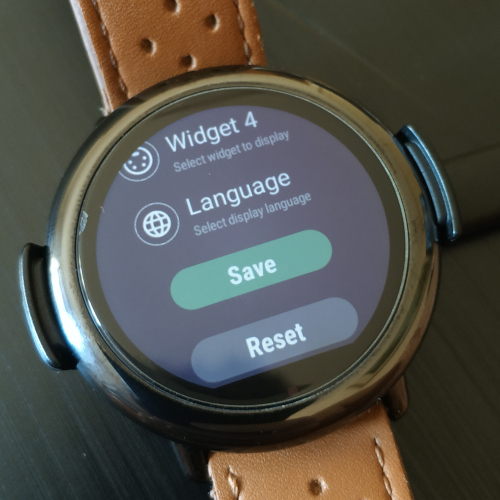
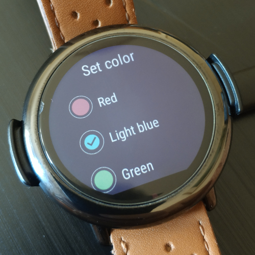
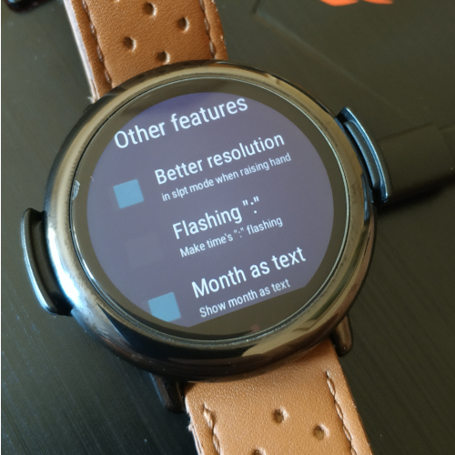
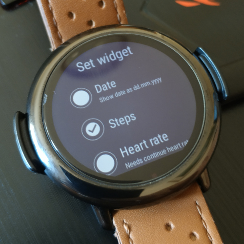
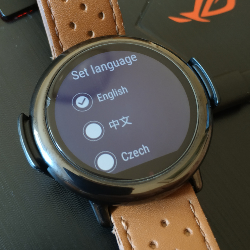

[ ](https://github.com/GreatApo/GreatFit/releases/latest) 
# GreatFit: Amazfit Pace/Stratos APK Watchface sources


Bla, bla, bla... will write something here later :P continue reading for now
XDA Topic [here](https://forum.xda-developers.com/smartwatch/amazfit/app-watchface-greatfit-v1-1-settings-t3791516)


### Features
- This is a Pace/Stratos APK watchface (Pace WOS2)
- Custom apk watchface with sources
- Supported languages: English, Chinese, Croatian, Czech, Dutch, French, German, Greek, Hebrew, Hungarian, Italian, Japanese, Polish, Portuguese, Romanian, Russian, Slovak, Spanish, Thai, Turkish
- Ability to change widgets/progress bars
- Seconds are enabled based on your system settings (refresh the watchface)
- More weather widgets (humidity, wind direction and strength, UV status, city)
- New watch alarm widget
- New air pressure, altitude/dive depth (calculated based on air pressure)
- New xdrip values widget (will be supported with Xdrip by Klaus3d3)
- New phone battery widget/bar (needs amazfit service+phone app)
- New phone alarm widget (needs amazfit service+phone app)
- New calories progress bar (set target in settings)
- New heart-rate progress bar (min 0 bpm, max 200 bpm)
- New world time widget, you can select the time difference it displays
- New notifications widget, see unread notifications (needs amazfit service+phone app)
- Better image resolution when raising hand
- Status bar position and enable/disable
- Many other options available in settings


### Tutorial for devs and stylers
This project scopes to provide an easy way to create Amazfit APK watchfaces even without coding skills! Take a look at [this](https://forum.xda-developers.com/smartwatch/amazfit/tutorial-create-apk-watchfaces-coding-t3822221) post.


### Download

Get a ready to use binary
 - From our [Github Releases](https://github.com/GreatApo/GreatFit/releases/latest)

Or if you are hardcore, compile the source code with Android Studio.


### Installation
To install this watchface, you will need a PC with the ADB installed. Connect your Amazfit on your PC and fire up a terminal.

ADB install command:
```shell
adb install -r GreatFit.X.X.apk
```
ADB uninstall command: (run this first if you get installation error message)
```shell
adb uninstall com.dinodevs.greatfitwatchface
```
Clear data: (not cleared with uninstall, run this if GreatFit crashes when changing versions)
```shell
adb shell pm clear com.dinodevs.greatfitwatchface
```

### Screenshots









### Credit where credit is due

This project couldn't be possible without getting familiar with the source code provided by Manuel Alvarez (whose code is [here](https://github.com/manuel-alvarez-alvarez/malvarez-watchface)). Additional work has be done by Fabio Barbon (whose code is [here](https://github.com/drbourbon/drbourbon-watchfaces)), Luis Baena (@LBA97) and Saúl Alemán (@Nxsaul) (whose code is [here](https://github.com/Nxsaul/AmazfitAPKs)).

Translations are ported from my Pace Calendar widget project (code [here](https://github.com/GreatApo/AmazfitPaceCalendarWidget), see translators in the changelog [here](https://forum.xda-developers.com/smartwatch/amazfit/app-widget-calendar-pace-t3751889)) and @GramThanos jsCalendar project (code [here](https://github.com/GramThanos/jsCalendar)).

Special thanks to:
- @lfom and @GramThanos for helping me out
- @KieronQuinn for the settings style code (from his [AmazfitStepNotify](https://github.com/KieronQuinn/AmazfitStepNotify) app)
- and all those invisible people giving back to the community by helping or donating!

This project couldn't be possible without the following free software:
• Android Studio
• APK Easy Tool (decompile-recompile)
• Notepad++ (smali editing)
• JD-gui (jar file decompiler)
• dex2jar (file type converter)
• SVADeodexerForArt (working deodexer for amazfit's system)
• 7zip

Libraries files (*.lib) have copyrights by Huami
