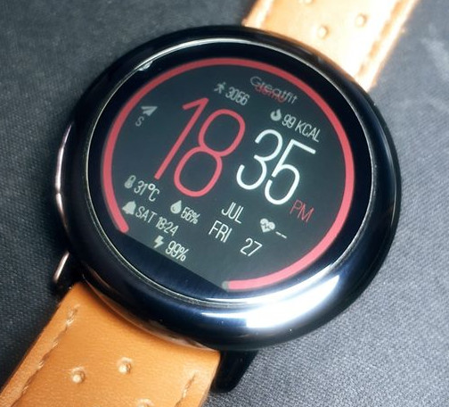

# Watchface for Amazfit smartwatch

Tutorial/Documentation:
https://forum.xda-developers.com/smartwatch/amazfit/tutorial-create-apk-watchfaces-coding-t3822221


[](https://github.com/GreatApo/GreatFit/releases/latest)

# GreatFit: Amazfit Pace/Stratos APK Watchface sources


After [Quinny899](https://github.com/KieronQuinn)'s excellent work, we are able to make widget/apps!
So, here is the first Calendar Widget for our Amazfit Pace/Stratos!


### Features
- This is a Pace/Stratos APK watchface (Pace WOS2)
- Custom apk watchface with sources
- Supported languages: English, Chinese, Czech, Dutch, French, German, Greek, Hebrew, Hungarian, Italian, Japanese, Polish, Portuguese, Russian, Slovak, Spanish, Turkish
- Ability to change widgets/progress bars
- Seconds are enabled based on your system settings (refresh the watchface)
- More weather widgets (humidity, wind direction and strength, UV status, city)
- New watch alarm widget
- New air pressure, altitude/dive depth (calculated based on air pressure)
- New xdrip values widget (will be supported with Xdrip by Klaus3d3)
- New phone battery widget (needs amazfit service+phone app)
- New calories progress bar (set target in settings)
- Better image resolution then raising hand

### Tutorial for devs and stylers
This project scopes to provide an easy way to create Amazfit APK watchfaces even without coding skills! Take a look at [this](https://forum.xda-developers.com/smartwatch/amazfit/tutorial-create-apk-watchfaces-coding-t3822221) post.

### Download

Get a ready to use binary
 - From our [Github Releases](https://github.com/GreatApo/GreatFit/releases/latest)

Or if you are hardcore, compile the source code with Android Studio.


### Installation
To install this watchface, you will need a PC with the ADB installed. Connect your Amazfit on your PC and fire up a terminal.

```shell
adb uninstall com.dinodevs.greatfitwatchface
adb install -r GreatFit.X.X.X.apk
adb reboot
```
Reboot is required for air pressure to work.


### Screenshots (Version 3.0.4)


### Credit where credit is due

This project couldn't be possible without getting familiar with the source code provided by Manual Alvarez (whose code is [here](https://github.com/manuel-alvarez-alvarez/malvarez-watchface)). Additional work has be done by Fabio Barbon (whose code is [here](https://github.com/drbourbon/drbourbon-watchfaces)), Luis Baena (@LBA97) and Saúl Alemán (@Nxsaul) (whose code is [here](https://github.com/Nxsaul/AmazfitAPKs)).

Translations are ported from my Pace Calendar widget project (code [here](https://github.com/GreatApo/AmazfitPaceCalendarWidget), see translators in the changelog [here](https://forum.xda-developers.com/smartwatch/amazfit/app-widget-calendar-pace-t3751889)) and @GramThanos jsCalendar project (code [here](https://github.com/GramThanos/jsCalendar)).


